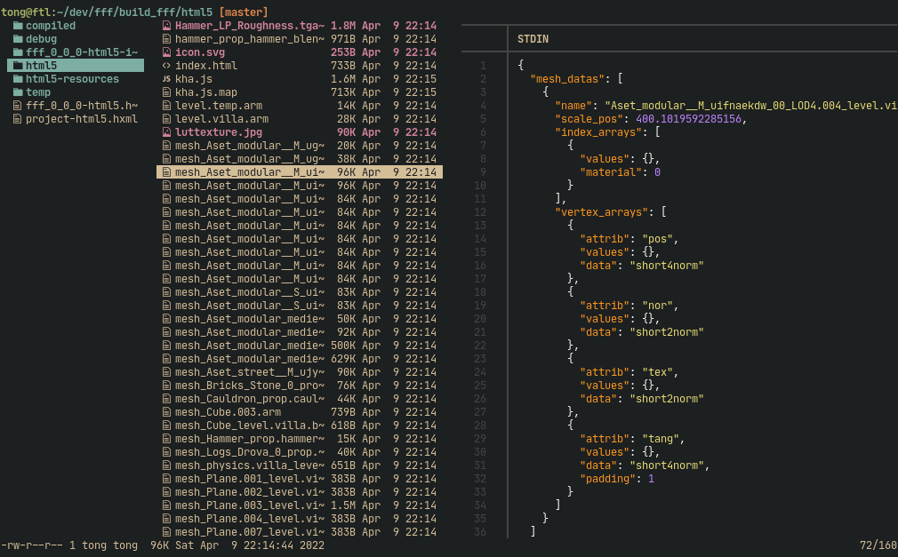

# Armcat
Print [armory3d](https://armory3d.org/) `arm` files as json.


## Example Usage

```sh
armcat <file.arm>
```

- Pretty print using [jq](https://stedolan.github.io/jq/)
```sh
armcat <file.arm> | jq .
```

- Print `Scene.arm` objects
```sh
armcat <file.arm> | jq .objects
```

- Print all traits of all `Scene.arm` objects
```sh
armcat Scene.arm | jq ".objects[].traits"
```

- Live preview integration for the [lf](https://github.com/gokcehan/lf/) file manager: [lf/preview#L27](https://github.com/tong/dotfiles/blob/a9d3ea950464c2273d7262b5c2cf57d68af61402/lf/.config/lf/preview#L27)  



