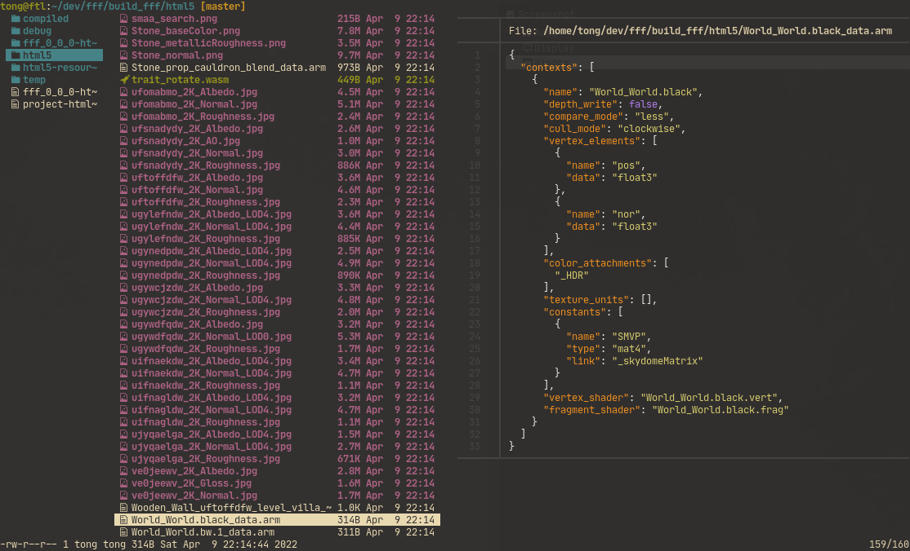

# Armcat
Print binary [armory3d](https://armory3d.org/) `arm` files as json.


## Build + Install

```sh
haxelib install build.hxml
ARMSDK=<path-to-armsdk>
haxe build.hxml
cp armcat.js /usr/bin/armcat
chmod +x /usr/bin/armcat
```


## Usage

```sh
armcat --help
Usage: armcat <file.arm> [options]

Options:
  [--json-indent] <str> : Indention string
  [--no-json]           : Skip json formatting
  [--help]
```


## Example Usage

Pretty print using [jq](https://stedolan.github.io/jq/):
```sh
armcat <file.arm> | jq .
```

Print all objects of given scene file:
```sh
armcat Scene.arm | jq .objects
```

Print all traits of all objects in given scene file:
```sh
armcat Scene.arm | jq ".objects[].traits"
```

Print decoded arm file without json formatting (note that this does **not**
output valid json):
```sh
armcat Scene.arm --no-format
```

Live preview integration into [lf](https://github.com/gokcehan/lf/) file
  manager using [bat](https://github.com/sharkdp/bat) for syntax highlighting
  ([lf/preview#L35](https://github.com/tong/dot/blob/1e0cf5cfb6ed502c58608d7c3e10791c598b3ce1/lf/.config/lf/preview#L35)):
  
```sh
armcat "$1" | bat --file-name "$1" --language json --color=always
```



